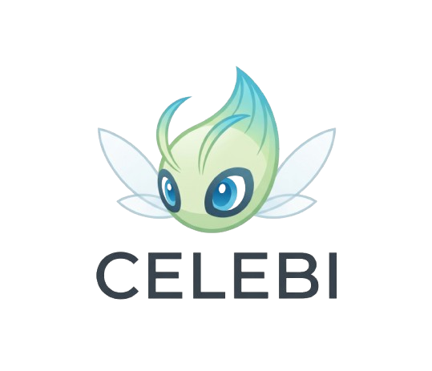

# Celebi

  

**Time-Travel Harness for LLM API Streams**

Celebi is a man-in-the-middle proxy that sits between your coding agent and LLM providers. It captures every request/response pair in a graph database, forming a timeline of conversations that you can visualize, search, and replay.

Named after the time-traveling Pokemon — because debugging LLMs should feel like time travel.

---

## Download

Go to [**GitHub Releases**](https://github.com/RjyavardhanSingh/celebi-harness/releases/latest) to download the latest installer.

| Platform | File | Guide |
|----------|------|-------|
| **macOS** (Apple Silicon / Intel) | `celebi-*-macos.dmg` | [Install Guide](install/macos.md) |
| **Linux** (Debian / Ubuntu) | `celebi_*_amd64.deb` | [Install Guide](install/linux.md) |
| **Windows** (x64) | `celebi-*-windows-setup.exe` | [Install Guide](install/windows.md) |

## What does Celebi do?

- **Captures** every API call between your agent and the LLM
- **Stores** conversations as a directed graph (prompt → response nodes)
- **Visualizes** the full conversation flow in a card-based graph view
- **Replays** any prompt to compare outputs
- **Searches** across all stored conversations by content
- **Tracks** token usage per request for cost analysis

## Quick Links

- [Install Celebi](install/index.md)
- [Quick Start Guide](quickstart.md)
- [Architecture Overview](architecture.md)
- [Supported Agents](agents/index.md)
- [Contributing](contributing.md)
